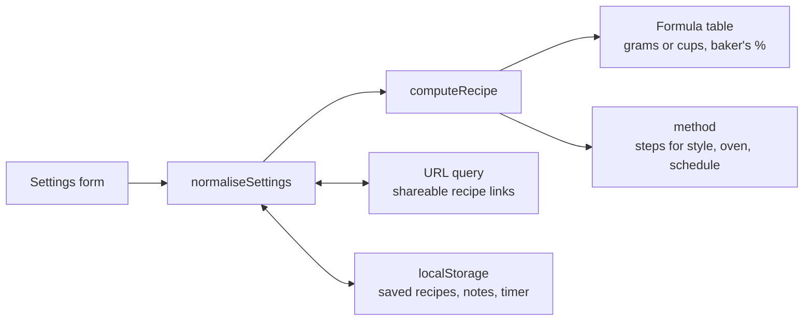

# Pizza Dough Generator

A pizza dough calculator for Neapolitan, New York, Detroit and Roman-style pizza.
Choose a style, how many, the hydration, your oven and your schedule, and it works
out the quantities, baker's percentages and a step-by-step method as you go.

**Try it:** https://jfor12.github.io/pizza-dough-generator/

## How it works



- **Baker's maths.** Every ingredient is a percentage of the flour weight, so the
  recipe scales cleanly from one pizza to twelve.

  | Style | Flour per pizza | Hydration | Salt |
  |---|---|---|---|
  | Neapolitan | 155 g | 68% | 2.8% |
  | New York | 170 g | 62% | 2.5% |
  | Detroit | 180 g | 72% | 2.2% |
  | Roman (40×30 cm tray) | 333 g | 80% | 2.5% |

- **Schedules.** Instant yeast is 1% of the flour for a quick 2–4 hour rise, 0.4%
  overnight and 0.2% for a 2–3 day cold ferment.
- **Room temperature.** Yeast goes down 5% per degree above 22°C and up 5% per
  degree below it, capped at ±50%. The rise step says whether to expect it to
  take longer or shorter.
- **Poolish.** 30% of the flour becomes a 100%-hydration pre-ferment with 0.1%
  yeast. The main dough gets the remainder, so the overall formula is unchanged.
- **Units.** Grams, or cups, ounces and teaspoons (flour at 125 g per cup, water
  at 237 g per cup), with grams always shown alongside.

It also keeps saved recipes and per-recipe notes, runs a dough timer that survives
closing the tab, gives every recipe a shareable link, and prints just the recipe.
Everything is stored in the browser only.

## Files

| File | What it does |
|---|---|
| `index.html` | The page, including the tips and glossary text |
| `styles.css` | All styles: light and dark themes, print layout |
| `dough.js` | The recipe maths: pure functions, no DOM |
| `method.js` | The step-by-step method for a recipe, in either unit system |
| `app.js` | Reads the form, renders the recipe, saving, notes, timer and theme |
| `tests/` | Unit tests for the maths and method |
| `fonts/` | Newsreader and IBM Plex Mono, self-hosted (SIL Open Font License) |

No build step and no dependencies: GitHub Pages serves the files as they are.

## Working on it

```bash
npm test                   # run the unit tests (Node 20+)
python3 -m http.server     # then open http://localhost:8000
```

The page uses ES modules, so open it through a local server rather than
straight from the file.

## Roadmap

- [x] Recipe sharing via URL
- [ ] More pizza styles (Sicilian, focaccia)
- [ ] Sourdough starter calculator
- [ ] Video tutorials
- [ ] Multi-language support
- [ ] Ingredient calculator for bulk preparation
- [ ] Mobile app version
