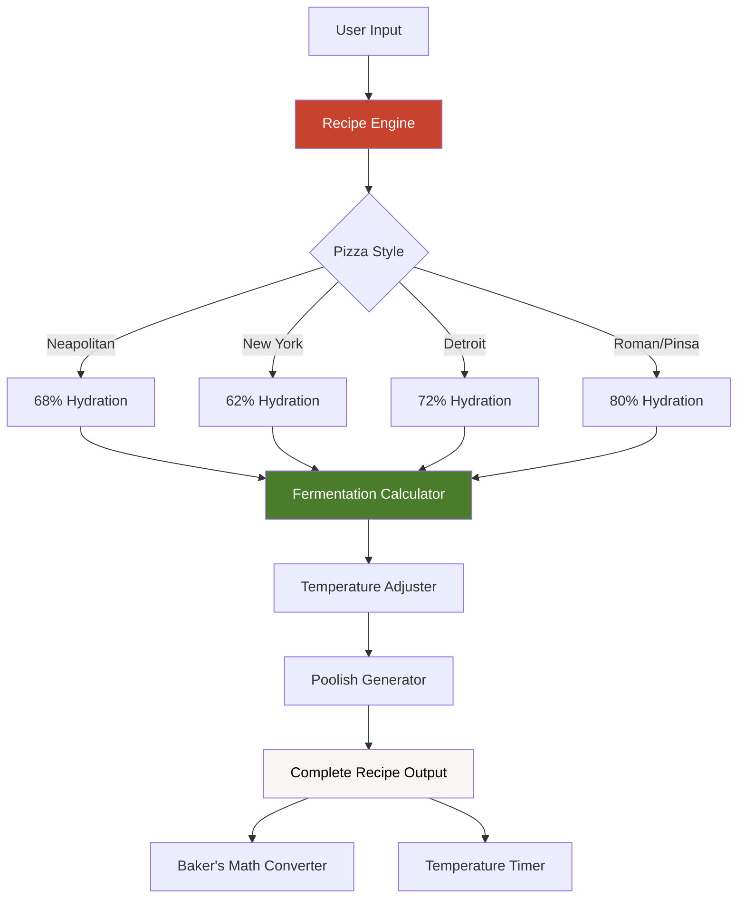

# Pizza Dough Generator
Production-grade recipe calculator delivering authentic Italian pizza recipes with scientific precision.

## 🚀 The High-Level Architecture

## ✨ Key Engineering Highlights
### 1. Scientific Recipe Calculations
**Baker's Percentage System**: Implemented true baker's math where all ingredients are calculated as percentages of flour weight, ensuring consistent results regardless of batch size.

**Temperature-Responsive Formulas**: Dynamic yeast calculations that adjust based on ambient temperature (10-30°C), automatically reducing yeast amounts for warmer environments to prevent over-fermentation.

**Hydration Optimisation**: Real-time hydration warnings and recommendations that guide users through the 55-80% hydration spectrum, with style-specific optimal ranges pre-configured.

### 2. Advanced Fermentation Science
**Multi-Timeline Support**: Three distinct fermentation paths (Quick: 2-4h, Overnight: 12-24h, Long: 2-3d) with exponentially decreasing yeast amounts for longer ferments.

**Poolish/Preferment System**: Automated 30% poolish calculator that splits ingredients between preferment and main dough, enhancing flavour complexity and digestibility.

**Dual Temperature Instructions**: Separate timing guidance for cold fermentation (4°C fridge) and room temperature proofing, accounting for thermal dynamics.

### 3. Professional UX & Design
**Theme Persistence**: Light/dark mode implementation with localStorage persistence and smooth CSS variable transitions across 12+ colour tokens.

**Progressive Disclosure**: Accordion-based ingredient sections and step-by-step instructions that reduce cognitive load while maintaining comprehensive detail.

**Style-Specific Intelligence**: Each pizza style (Neapolitan, NY, Detroit, Roman) includes tailored baking temperatures, flour amounts per unit, and technique variations.

## 🌐 Live Application
**Try it now**: [jacopofornesi.co.uk/pizza-dough-generator](https://jacopofornesi.co.uk/pizza-dough-generator/)

## 🛠️ Tech Stack
- **Language**: Vanilla JavaScript (zero dependencies)
- **Styling**: TailwindCSS, CSS Custom Properties
- **APIs**: LocalStorage, Web Share, Clipboard, Notifications
- **Architecture**: Single-page static HTML (1,601 lines)
- Design influenced by modern web aesthetics
- Built with love for pizza enthusiasts worldwide

## 🐛 Known Issues

None at the moment! If you find any bugs, please [open an issue](https://github.com/Jfor12/pizza-dough-generator/issues).

## 🗺️ Roadmap

Completed features:
- [x] Roman/Pinsa style pizza (40×30cm trays with correct 333g flour per tray)
- [x] Comprehensive step-by-step instructions with temperature guidance
- [x] Temperature-based yeast adjustments
- [x] Baker's percentage display
- [x] Recipe scaling functionality
- [x] Recipe favourites system (up to 10 saved recipes with custom names)
- [x] Fermentation timer with notifications
- [x] Full unit toggle (metric/imperial for ingredients, temperatures, and sizes)
- [x] Dynamic measurement conversion throughout all instructions
- [x] Ingredient substitutions guide
- [x] Poolish/preferment option with measurement conversion
- [x] Recipe notes functionality
- [x] Print/PDF export with proper formatting
- [x] Tab navigation for better organisation
- [x] Timer persistence across page refreshes and browser closure
- [x] Custom recipe naming with persistent titles
- [x] Auto-load saved recipes with tab switching

Potential future enhancements:
- [ ] More pizza styles (Sicilian, Focaccia, etc.)
- [ ] Sourdough starter calculator
- [ ] Video tutorials integration
- [ ] Multi-language support
- [ ] Ingredient calculator for bulk preparation
- [ ] Recipe sharing via URL
- [ ] Mobile app version

---

**Made with ❤️ and a passion for perfect pizza**
